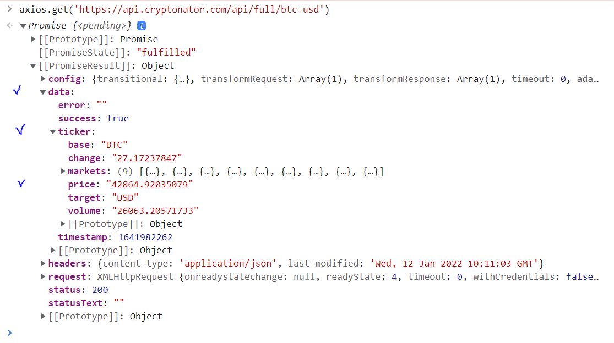
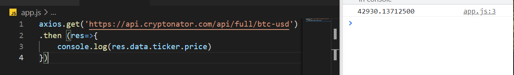
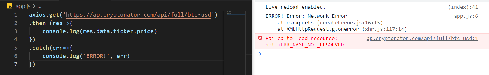
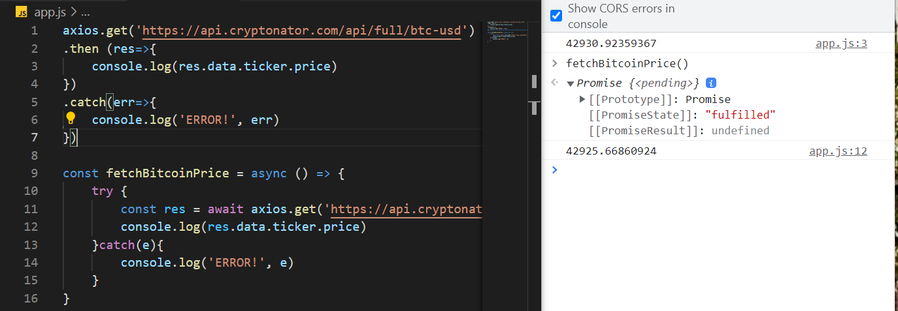
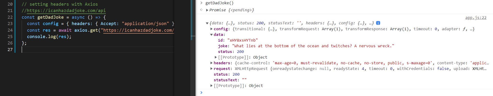

```Axios``` library is one of the options (among others are promises and async functions) for making requests in JS.
1 - axios.get():


2 - catching an error:

3 - an example of a function:

3 - setting headers with Axios:

*to extract a joke:
```
console.log(res.data.joke)
```

[Right-click to inspect the dev tools console](https://verson-tech.github.io/Axios/)


